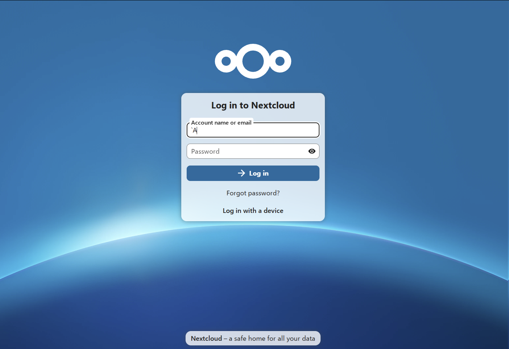
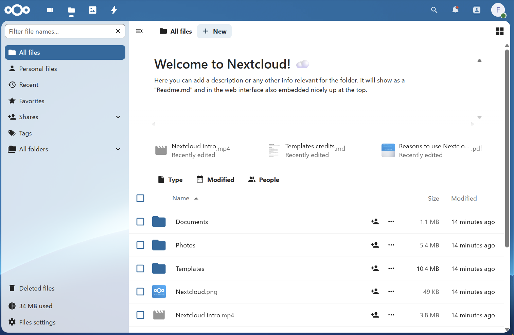
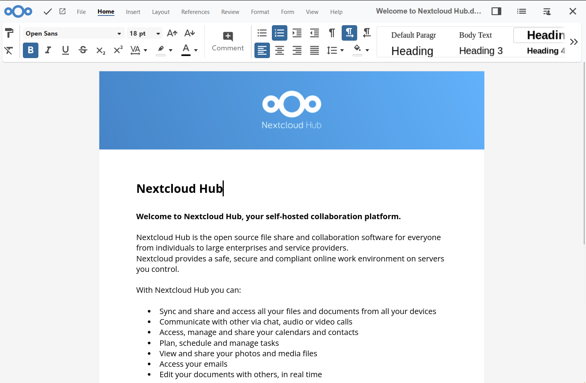
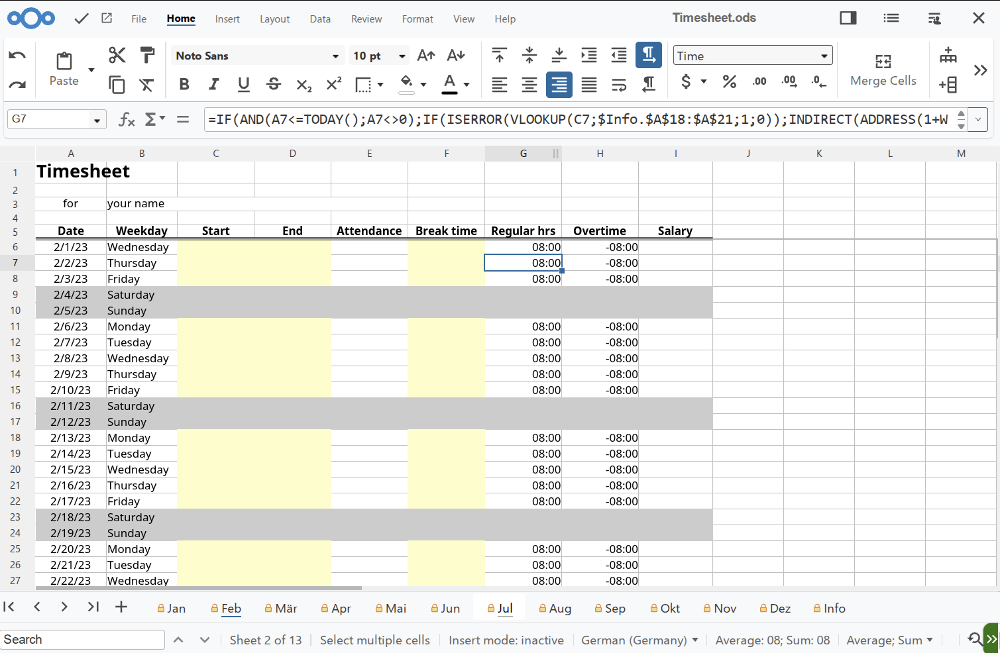

# What is NextCloud

### Docker NextCloud module **[WHMCS](https://puqcloud.com/link.php?id=77)**

##### [Order now](https://puqcloud.com/whmcs-module-docker-nextcloud.php) | [Download](https://download.puqcloud.com/WHMCS/servers/PUQ_WHMCS-Docker-NextCloud/) | [FAQ](https://faq.puqcloud.com/) | [n8n](https://puqcloud.com/link.php?id=117)

## What is NextCloud? An Overview of the Secure, Self-Hosted Cloud Platform

NextCloud is a powerful, self-hosted cloud platform designed to provide secure, private, and convenient access to your files, documents, and collaborative tools. Unlike traditional cloud services, NextCloud puts the ownership and control of your data directly into your hands, ensuring unmatched privacy and flexibility.

## Key Features and Benefits of NextCloud

- **Secure File Sharing:** Easily and securely share files and folders internally or externally, with granular access permissions.
- **Collaboration Tools:** Built-in collaborative editing with NextCloud Office (powered by Collabora Online), enabling seamless teamwork on documents, spreadsheets, and presentations in real-time.
- **Privacy-Centric:** Complete ownership and control of your data, hosted on your own hardware or infrastructure, significantly enhancing data privacy.
- **Expandable and Modular:** Extend NextCloud's functionality with hundreds of available apps, customizing it to meet specific business or personal requirements.

## NextCloud Office: Advanced Document Collaboration

NextCloud Office integrates seamlessly into NextCloud, providing advanced collaboration capabilities directly within your cloud environment. Powered by Collabora Online, NextCloud Office allows teams to create, edit, and collaborate on office documents directly from a web browser, without compromising privacy or security.

- **Real-time Collaboration:** Edit documents, spreadsheets, and presentations simultaneously with team members from anywhere in the world.
- **Compatibility:** Fully compatible with Microsoft Office and LibreOffice documents, ensuring a smooth transition and interoperability.
- **Privacy-Focused:** All documents remain securely on your own infrastructure, without external data leaks or third-party access.

## Mobile and Web Accessibility

NextCloud offers robust mobile applications for Android and iOS, ensuring your files, documents, and collaborative spaces are accessible from any device, anywhere. Additionally, the intuitive web interface provides easy access to your cloud environment via any modern web browser.

## Who Should Use NextCloud?

NextCloud is ideal for individuals, businesses, and organizations that value data sovereignty, security, and seamless collaboration. Whether you're managing a small business or a large enterprise, NextCloud’s scalability and robust feature set make it a compelling self-hosted solution for your cloud needs.

For those seeking privacy, flexibility, and control over their data and collaborative processes, NextCloud paired with NextCloud Office represents a powerful, secure, and future-ready choice.

Remember to regularly maintain your NextCloud instance and stay updated to ensure security, performance, and reliability.

