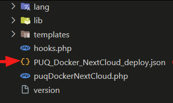
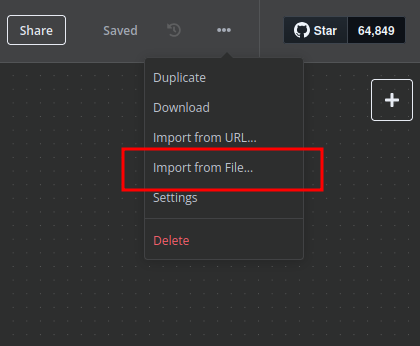
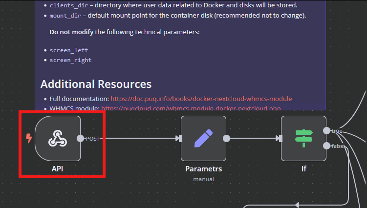
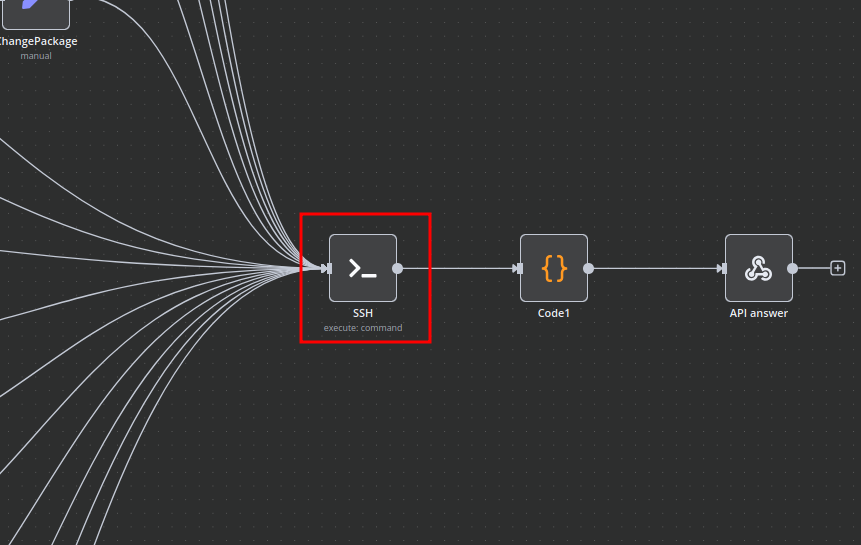
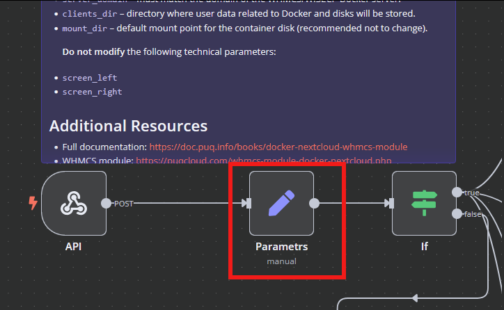
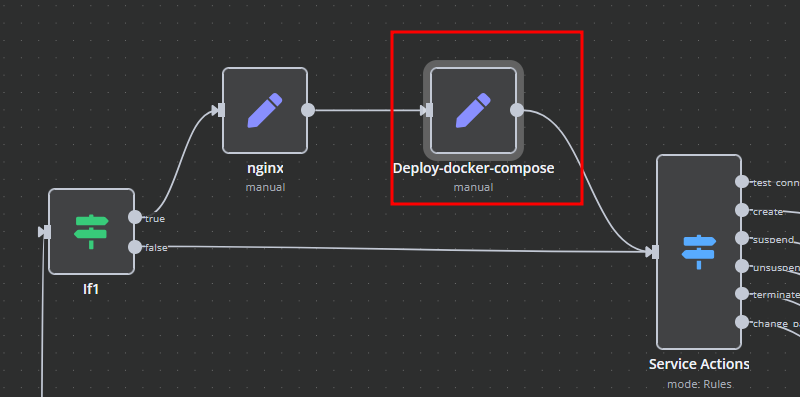
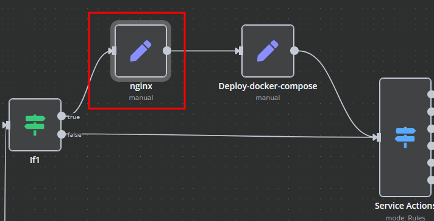
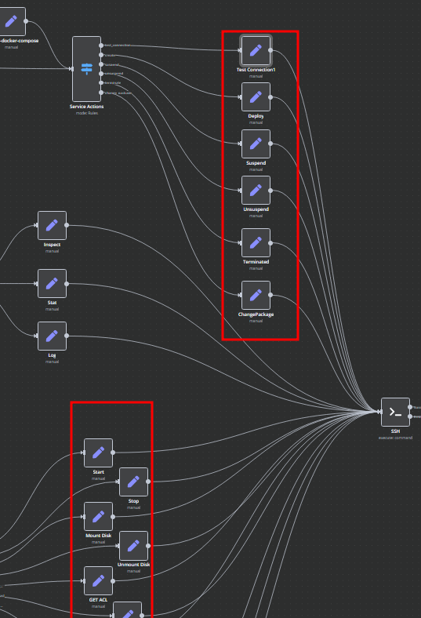

# Setting up n8n workflow

### Docker NextCloud module **[WHMCS](https://puqcloud.com/link.php?id=77)**

##### [Order now](https://puqcloud.com/whmcs-module-docker-nextcloud.php) | [Download](https://download.puqcloud.com/WHMCS/servers/PUQ_WHMCS-Docker-NextCloud/) | [FAQ](https://faq.puqcloud.com/) | [n8n](https://puqcloud.com/link.php?id=117)

## Overview

The **Docker NextCloud WHMCS module** leverages a sophisticated workflow for **n8n**, designed to automate the comprehensive deployment, configuration, and management processes for NextCloud and NextCloud Office services. Through its intuitive API interface, the workflow securely receives commands and orchestrates predefined tasks via SSH on your Docker-hosted server, ensuring streamlined operations and efficient management.

## Prerequisites

- You must deploy your own dedicated **n8n** server to manage workflows effectively.
- Alternatively, you may opt for the official **n8n** cloud-based solutions accessible via: [n8n Official Site](https://n8n.partnerlinks.io/o692v7cg297k)
- Your Docker server must be accessible via SSH with necessary permissions.

## Installation Steps

### Install the Required Workflow on n8n

You can select from two convenient installation options:

#### **Option 1: Use the Latest Version from the n8n Marketplace**

- The latest workflow templates are continuously updated and available on the n8n marketplace.
- Explore all templates provided by PUQcloud directly here: [PUQcloud on n8n](https://n8n.io/creators/puqcloud/)

#### **Option 2: Manual Installation**

- Each module version includes a bundled workflow template file.

- Import this workflow file directly into your n8n server manually.

## n8n Workflow API Backend Setup for WHMCS

### Configure API Webhook and SSH Access

- Create a secure **Basic Auth Credential** for Webhook API interactions within n8n. [
- Create an **SSH Credential** within n8n to securely communicate with the Docker host. 

### Modify Template Parameters

Adjust and update the following critical parameters to match your deployment specifics:

- `server_domain` – Set this to the domain of your WHMCS Docker server.
- `clients_dir` – Specify the directory where user data and related resources will be stored.
- `mount_dir` – The standard mount point for container storage (recommended to remain unchanged).

**Do not alter** the following technical parameters to avoid workflow disruption: `screen_left`, `screen_right`.

### **Deploy-docker-compose Configuration**

Fine-tune Docker Compose configurations tailored specifically for these critical operational scenarios:

- Initial service provisioning and setup
- Service suspension and subsequent unlocking
- Service configuration updates
- Routine service maintenance tasks

### **nginx Configuration Management**

Enhance and customize proxy server configurations using the dedicated nginx workflow element:

- **main**: Define specialized parameters within the server configuration block.
- **main\_location**: Set custom headers, caching policies, and routing rules for the root location.

### **Bash Script Automation**

Automate Docker container management and related server tasks through dynamically generated Bash scripts within n8n. Scripts execute securely via SSH and provide responses in JSON or plain text formats for easy parsing and logging.

- Scripts are conveniently linked directly to the SSH action elements.
- You retain complete flexibility to adapt or extend these scripts as necessary to meet your precise operational requirements.

