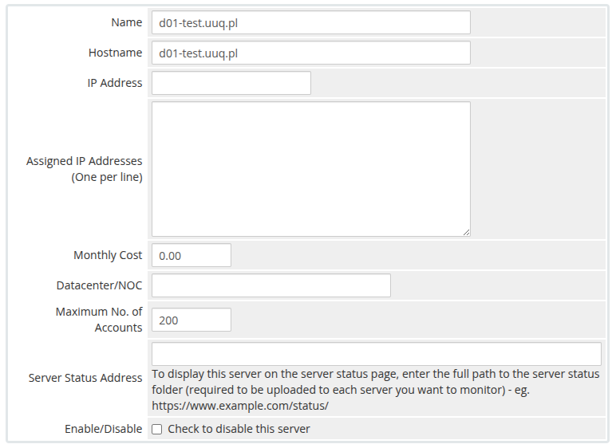
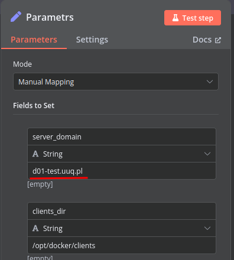
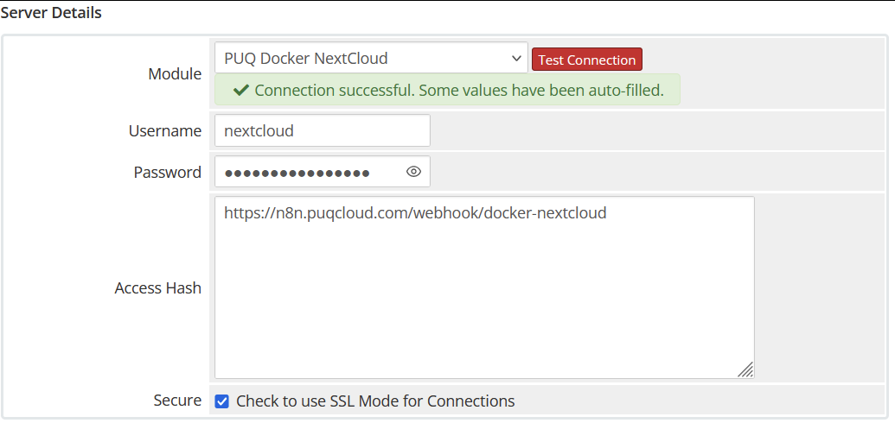
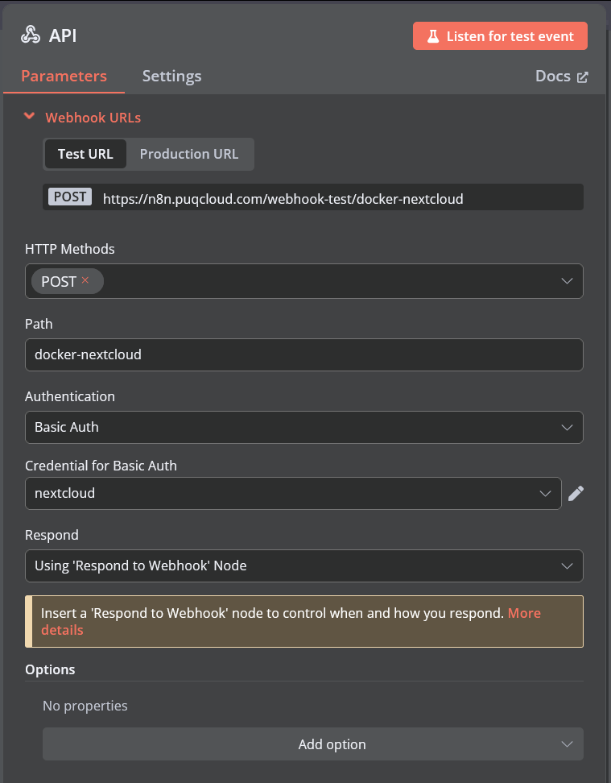

# Add server

### Docker NextCloud module **[WHMCS](https://puqcloud.com/link.php?id=77)**

##### [Order now](https://puqcloud.com/whmcs-module-docker-nextcloud.php) | [Download](https://download.puqcloud.com/WHMCS/servers/PUQ_WHMCS-Docker-NextCloud/) | [FAQ](https://faq.puqcloud.com/) | [n8n](https://puqcloud.com/link.php?id=117)

##### Add a new server to the WHMCS system.

```
System Settings->Servers->Add New Server
```

- Enter the correct **Name** and **Hostname** for your server.

[](../img/17-add-server-1.png)

<p class="callout warning">**Attention: Important Information** The **hostname** field must precisely match the domain configured as **server\_domain** in the **n8n workflow**. Misalignment between these parameters will disrupt the communication between WHMCS and Docker. Furthermore, ensure this domain is configured so that all subdomains point correctly to the Docker server's IP address.</p>

[](../img/18-add-server-n8n-workflow.png)

In the **Server Details** section, choose the module **"PUQ Docker NextCloud"**. Enter the accurate **username** and **password** as configured for the **API endpoint** in the n8n workflow.

<p class="callout warning">Additionally, input the **URL of the API entry point** from the n8n workflow into the **Access Hash** field.</p>

[](../img/19-add-server-2.png)

[](../img/20-add-server-n8n-workflow-api-setting.png)