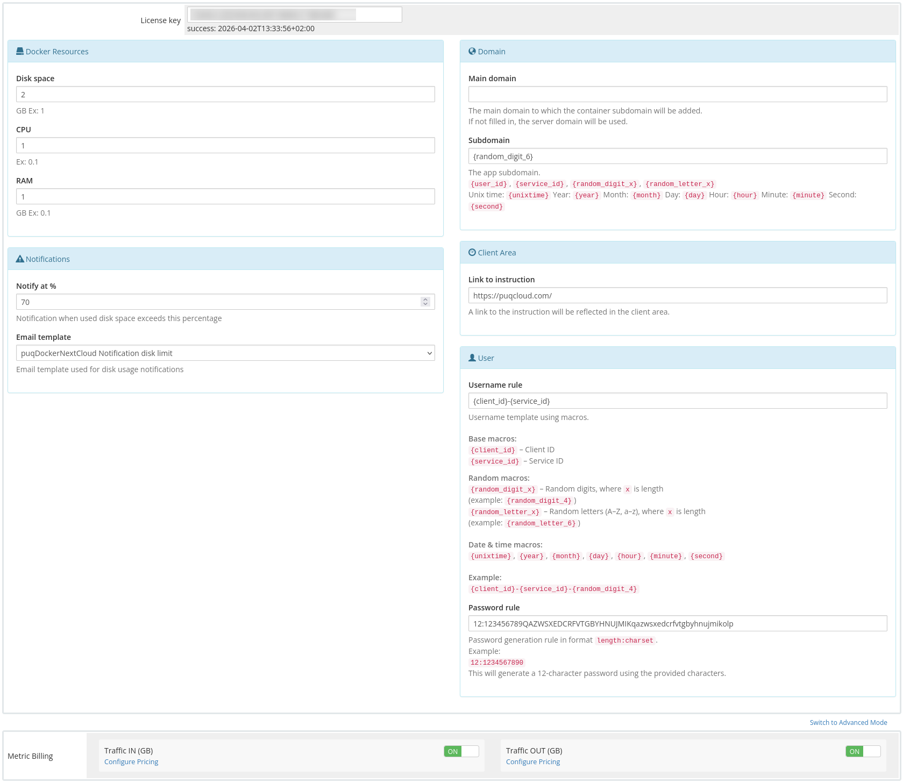

# Product Configuration

### Docker NextCloud module **[WHMCS](https://puqcloud.com/link.php?id=77)**

##### [Order now](https://puqcloud.com/whmcs-module-docker-nextcloud.php) | [Download](https://download.puqcloud.com/WHMCS/servers/PUQ_WHMCS-Docker-NextCloud/) | [FAQ](https://faq.puqcloud.com/) | [n8n](https://puqcloud.com/link.php?id=117)

##### Add new product to WHMCS

```
System Settings->Products/Services->Create a New Product
```

In the **Module settings** section, select the **"PUQ Docker NextCloud"** module.

- **License key –** A pre-purchased, active license key for the **"PUQ Docker NextCloud"** module is required for proper operation.
- **Disk space –** Specifies the disk space allocated to the NextCloud Docker container.
- **CPU –** Sets the CPU usage limit for the Docker container.
- **RAM –** Determines the amount of RAM allocated to the Docker container.
- **Link to instruction –** URL to documentation or instructions that will appear in the client's service management panel, if provided.
- **Main domain –** The primary domain for accessing NextCloud’s web interface. If left empty, the domain specified in the server’s **hostname** setting will be used.
- **Subdomain –** Assigns an individual subdomain for each service. If left blank or if the subdomain already exists, it will automatically generate using the format **{user\_id}-{service\_id}**.
- ### Supported Macros for **App Subdomain**:


    - **{user\_id}** – Client ID
    - **{service\_id}** – Service ID
    - **{random\_digit\_x}** – Generates random digits (x specifies length)
    - **{random\_letter\_x}** – Generates random letters (x specifies length)
    - **{unixtime}** – Current Unix timestamp
    - **{year}, {month}, {day}, {hour}, {minute}, {second}** – Date and time values
- **Notification, used disk space X % –** Defines the percentage threshold of disk usage at which the client receives a notification alert.
- **Notification disk limit email template –** Select an email template that will be sent automatically when the disk usage threshold is reached.

[](../img/21-product-configuration-product-setting.png)