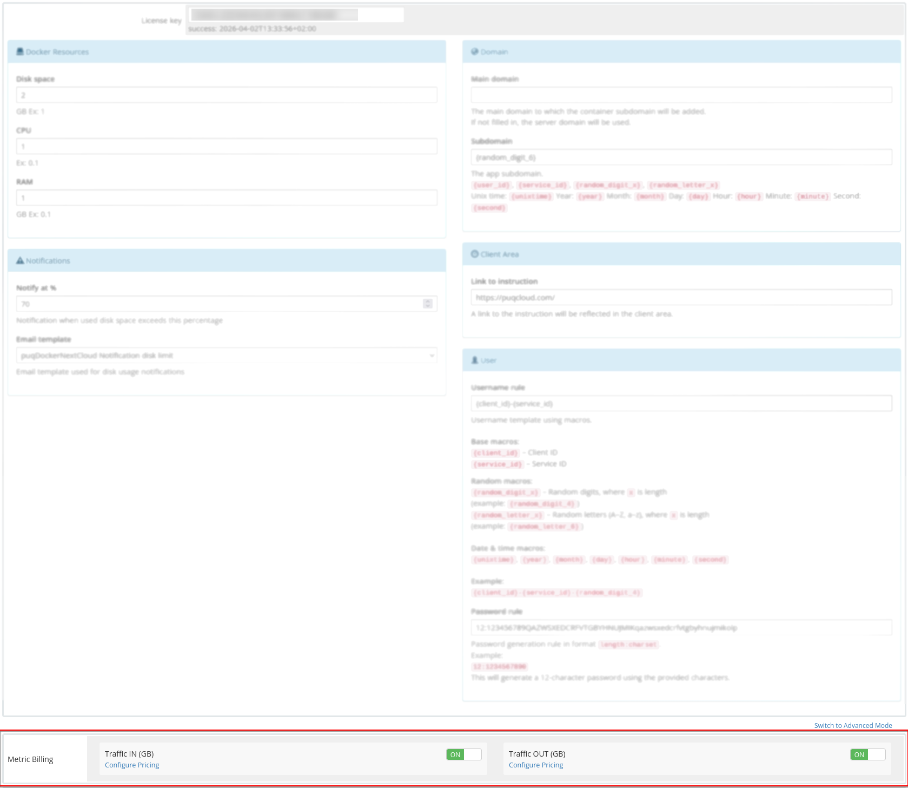
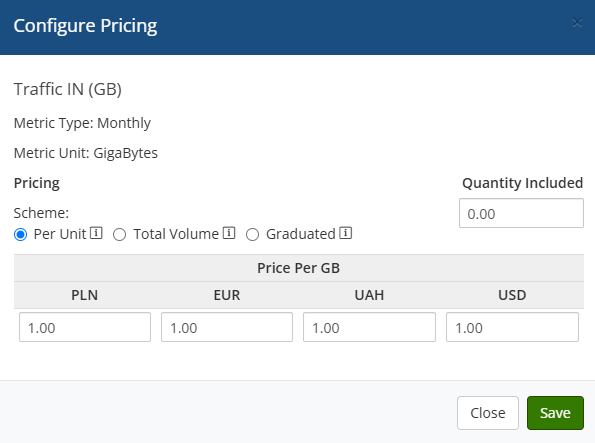

# Metric Billing

### Docker NextCloud module **[WHMCS](https://puqcloud.com/link.php?id=77)**

##### [Order now](https://puqcloud.com/whmcs-module-docker-nextcloud.php) | [Download](https://download.puqcloud.com/WHMCS/servers/PUQ_WHMCS-Docker-NextCloud/) | [FAQ](https://faq.puqcloud.com/) | [n8n](https://puqcloud.com/link.php?id=117)

To bill specific metrics individually, you can utilize the standard WHMCS Metric Billing mechanism integrated with the Docker NextCloud module.

To configure Metric Billing, you must activate the relevant metrics and define the desired pricing. Metrics billing utilizes the default WHMCS functionality. For detailed documentation on how WHMCS Metric Billing operates, visit:

[https://docs.whmcs.com/products/configuration-options/usage-billing/](https://docs.whmcs.com/products/configuration-options/usage-billing/)

