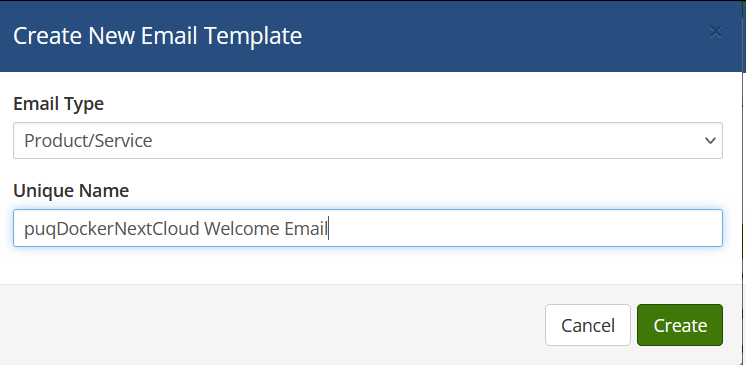
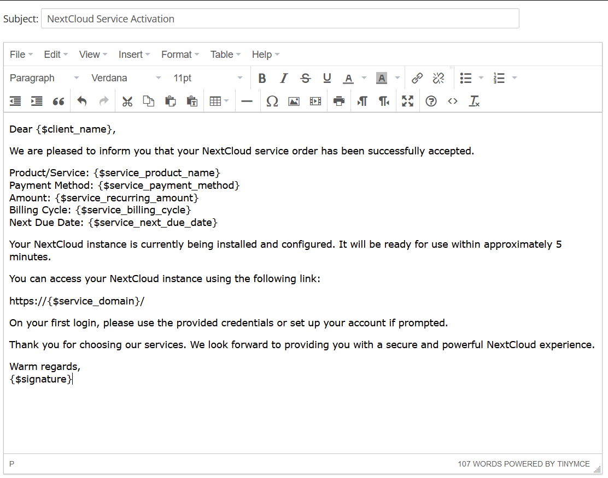

# Email Template (puqDockerNextCloud Welcome Email)

### Docker NextCloud module **[WHMCS](https://puqcloud.com/link.php?id=77)**

##### [Order now](https://puqcloud.com/whmcs-module-docker-nextcloud.php) | [Download](https://download.puqcloud.com/WHMCS/servers/PUQ_WHMCS-Docker-NextCloud/) | [FAQ](https://faq.puqcloud.com/) | [n8n](https://puqcloud.com/link.php?id=117)

##### Create an email template for customer notifications.

```
System Settings->Email Templates->Create New Email Template
```

- **Email Type:** Product/service
- **Unique Name:** puqDockerNextCloud Welcome Email

[](../img/24-email-template-welcome-name-example.png)

**Subject:**

```
NextCloud Service Activation
```

**Body:**

```
Dear {$client_name},

We are pleased to inform you that your NextCloud service order has been successfully accepted.

Product/Service: {$service_product_name}
Payment Method: {$service_payment_method}
Amount: {$service_recurring_amount}
Billing Cycle: {$service_billing_cycle}
Next Due Date: {$service_next_due_date}

Your NextCloud instance is currently being installed and configured. It will be ready for use within approximately 5 minutes.

You can access your NextCloud instance using the following link:

https://{$service_domain}/

On your first login, please use the provided credentials or set up your account if prompted.

Thank you for choosing our services. We look forward to providing you with a secure and powerful NextCloud experience.

Warm regards,
{$signature}
```

[](../img/25-email-template-welcome-body-example.png)