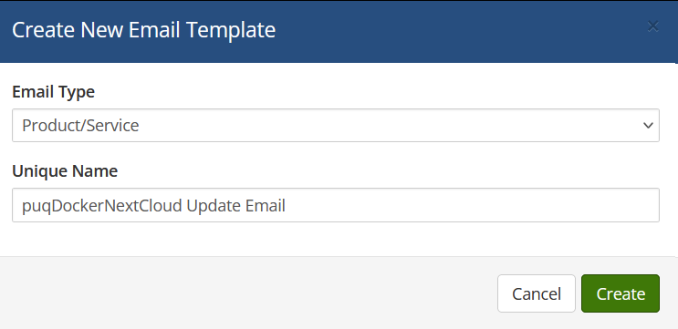
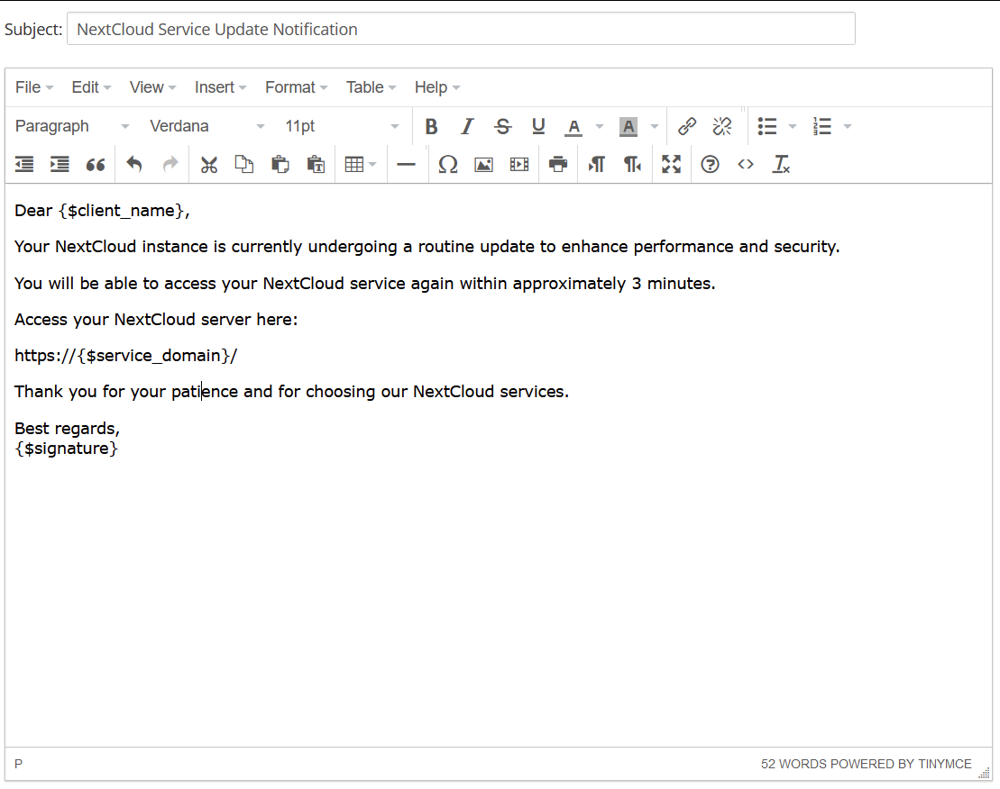

# Email Template (puqDockerNextCloud Update Email)

### Docker NextCloud module **[WHMCS](https://puqcloud.com/link.php?id=77)**

##### [Order now](https://puqcloud.com/whmcs-module-docker-nextcloud.php) | [Download](https://download.puqcloud.com/WHMCS/servers/PUQ_WHMCS-Docker-NextCloud/) | [FAQ](https://faq.puqcloud.com/) | [n8n](https://puqcloud.com/link.php?id=117)

##### Create an email template for customer notifications.

```
System Settings->Email Templates->Create New Email Template
```

- **Email Type:** Product/service
- **Unique Name:** puqDockerNextCloud Update Email

[](../img/26-email-template-update-name-example.png)

**Subject:**

```
NextCloud Service Update Notification
```

**Body:**

```
Dear {$client_name},

Your NextCloud instance is currently undergoing a routine update to enhance performance and security.

You will be able to access your NextCloud service again within approximately 3 minutes.

Access your NextCloud server here:

https://{$service_domain}/

Thank you for your patience and for choosing our NextCloud services.

Best regards,
{$signature}
```

[](../img/27-email-template-update-body-example.png)