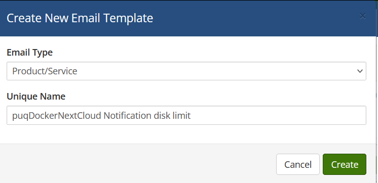
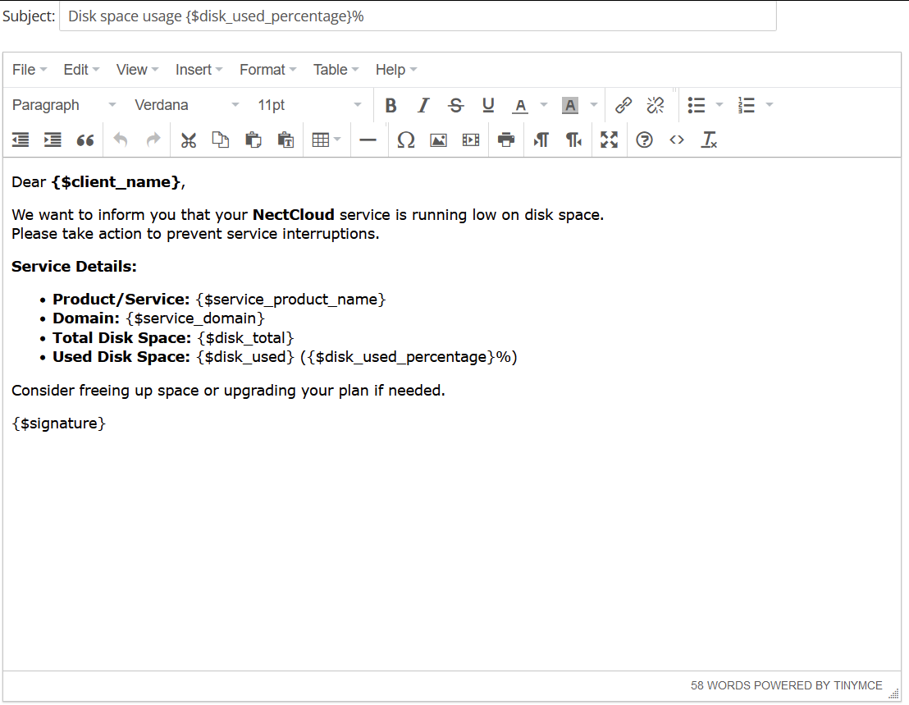

# Email Template (puqDockerNextCloud Notification disk limit)

### Docker NextCloud module **[WHMCS](https://puqcloud.com/link.php?id=77)**

##### [Order now](https://puqcloud.com/whmcs-module-docker-nextcloud.php) | [Download](https://download.puqcloud.com/WHMCS/servers/PUQ_WHMCS-Docker-NextCloud/) | [FAQ](https://faq.puqcloud.com/) | [n8n](https://puqcloud.com/link.php?id=117)

##### Create an email template for customer notifications.

```
System Settings->Email Templates->Create New Email Template
```

- **Email Type:** Product/service
- **Unique Name:** puqDockerNextCloud Notification disk limit

[](../img/28-email-template-notification-name-example.png)

**Subject:**

```
NextCloud Disk Usage Alert: {$disk_used_percentage}% Used
```

**Body:**

```
Dear {$client_name},

We would like to inform you that your NextCloud service is approaching its disk space limit. Please take immediate action to avoid any potential interruptions to your service.

Service Details:

Product/Service: {$service_product_name}
Domain: {$service_domain}
Total Disk Space: {$disk_total}
Used Disk Space: {$disk_used} ({$disk_used_percentage}%)

Consider removing unnecessary files, or contact us to upgrade your disk space plan.

Thank you for your attention.

Best regards,
{$signature}
```

[](../img/29-email-template-notification-body-example.png)