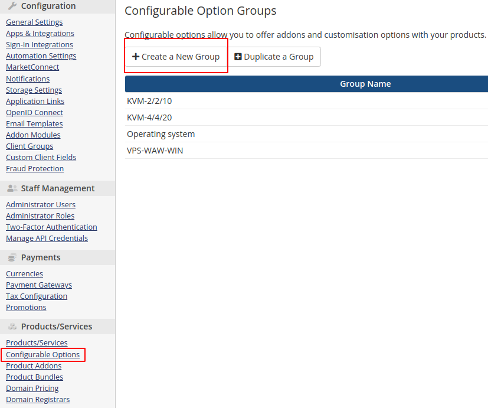
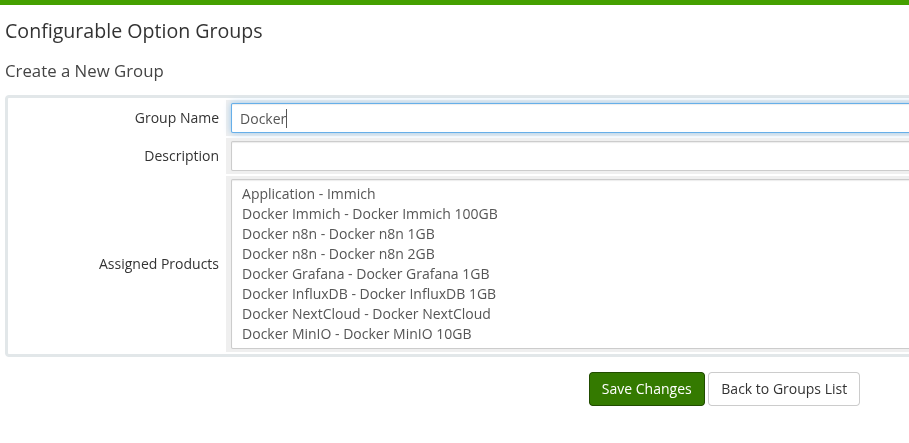
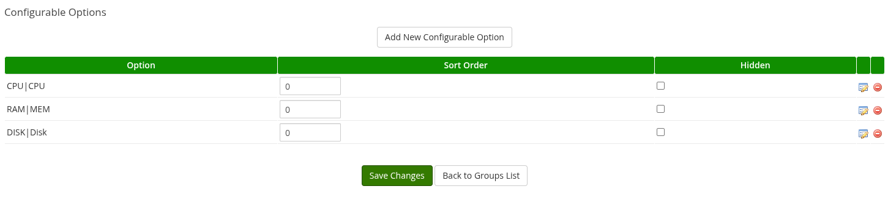
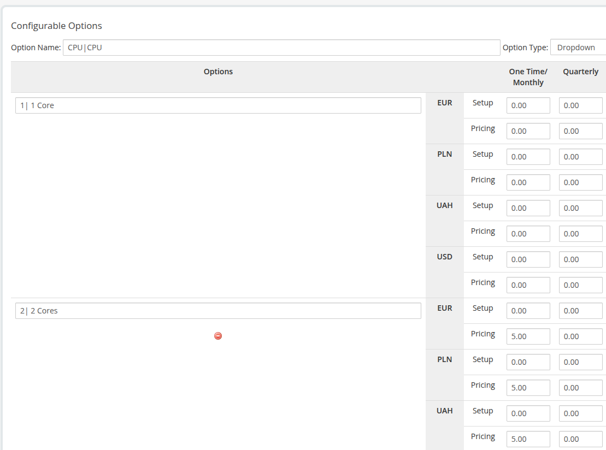
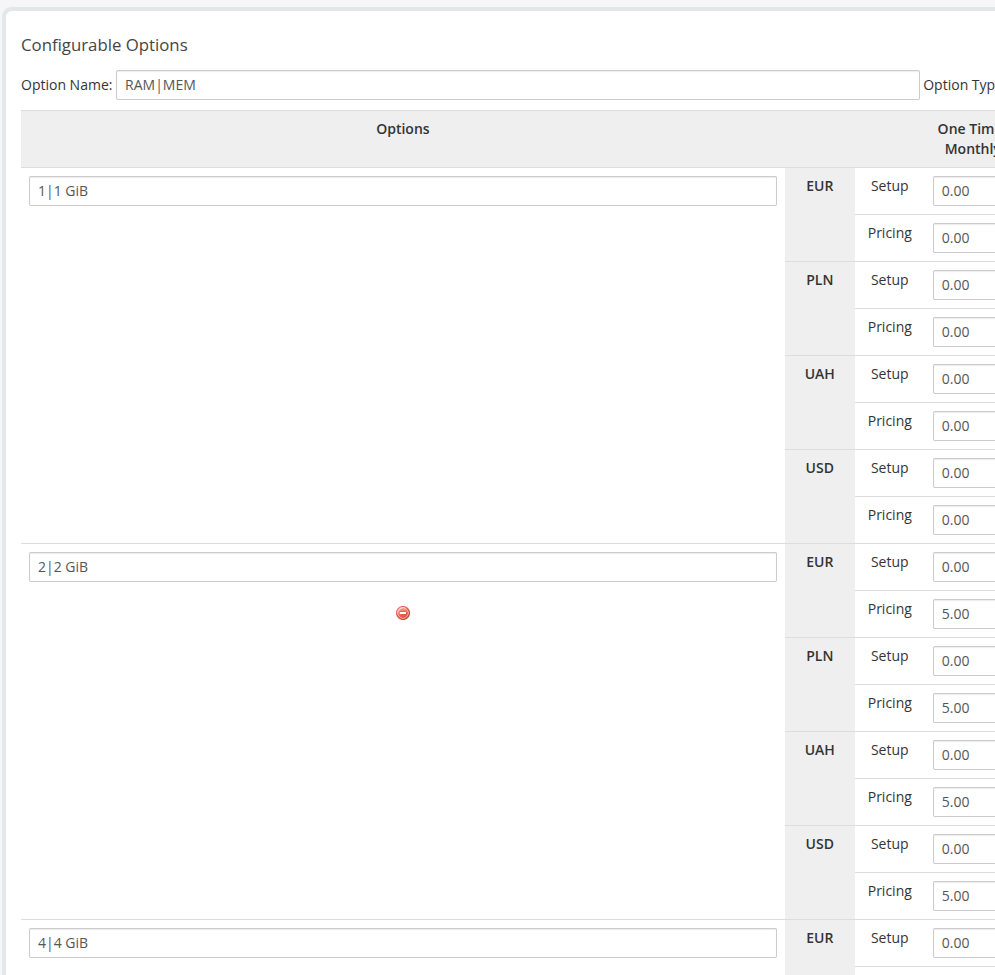
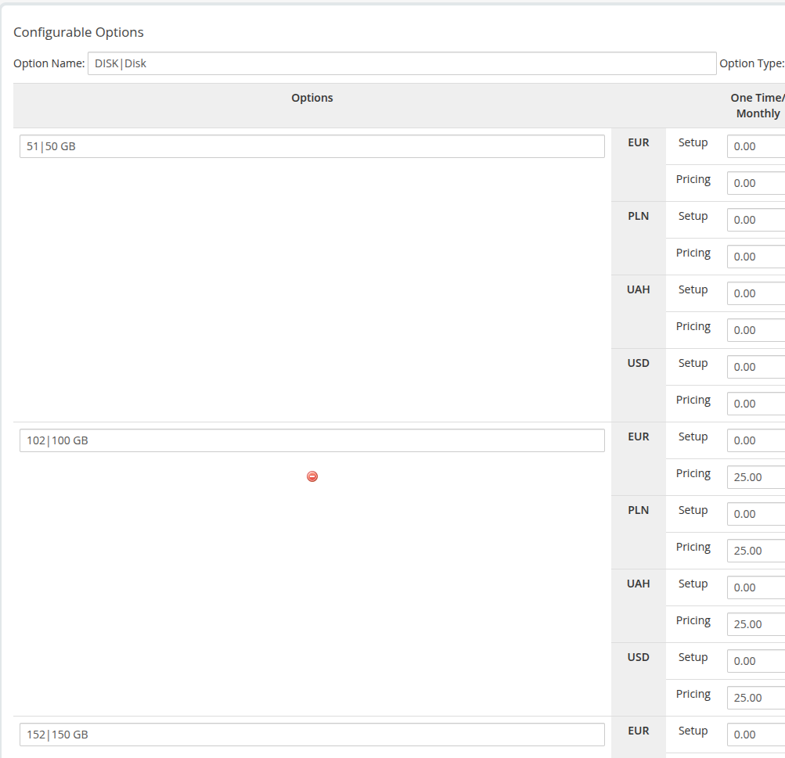

# Configurable Option (CPU/RAM/DISK)

### Docker NextCloud module **[WHMCS](https://puqcloud.com/link.php?id=77)**

##### [Order now](https://puqcloud.com/whmcs-module-docker-nextcloud.php) | [Download](https://download.puqcloud.com/WHMCS/servers/PUQ_WHMCS-Docker-NextCloud/) | [FAQ](https://faq.puqcloud.com/) | [n8n](https://puqcloud.com/link.php?id=117)

In order for the client to have a choice of operating system in the configuration of the virtual machine for NextCloud, you need to configure the Configurable Options and link them to the package.

#### Create Group

Add new Configurable Option to WHMCS

```
System Settings -> Configurable Option -> Create a New Group
```

[](../img/30-configurable-option-1.png)

**Enter the group name, description, and select the products you need.**

**Group Name:** NextCloud

[](../img/31-configurable-option-2.png)

#### Add Configurable Option

[](../img/32-configurable-option-3.png)

##### CPU|CPU – The first element before `|` must remain unchanged, the second is the label shown to clients

[](../img/33-configurable-option-4.png)

The first part in the option is responsible for the quantity, and the second is just a description.

##### RAM|MEM – The first element before `|` must remain unchanged, the second is the label shown to clients

[](../img/34-configurable-option-5.png)

The first part in the option is responsible for the quantity, and the second is just a description.

##### DISK|Disk – The first element before `|` must remain unchanged, the second is the label shown to clients

[](../img/35-configurable-option-6.png)

The first part in the option is responsible for the quantity, and the second is just a description.