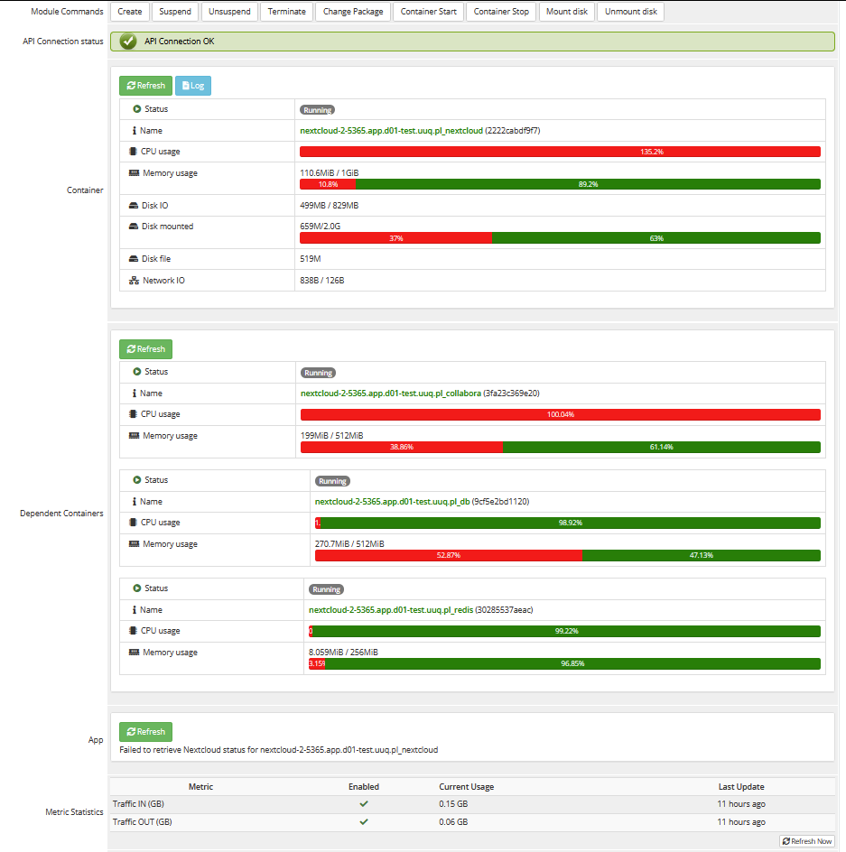

# Product Information

### Docker NextCloud module **[WHMCS](https://puqcloud.com/link.php?id=77)**

##### [Order now](https://puqcloud.com/whmcs-module-docker-nextcloud.php) | [Download](https://download.puqcloud.com/WHMCS/servers/PUQ_WHMCS-Docker-NextCloud/) | [FAQ](https://faq.puqcloud.com/) | [n8n](https://puqcloud.com/link.php?id=117)

### **Admin Panel – Container Management Overview**

The **admin panel** is designed to simplify management and is divided into clear sections, providing intuitive controls and real-time data for your NextCloud instance.

#### **Control Buttons**

- **Container Start / Stop** – Initiates or stops the NextCloud container seamlessly.
- **Mount Disk / Unmount Disk** – Allows administrators to securely attach or detach the container's storage volume, ensuring correct mounting via modifications to the **fstab** file.

#### **Container Status &amp; Resource Monitoring**

- **Status** – Clearly indicates the container's operational status (Running / Stopped).
- **Name** – Unique identifier and associated domain for easy reference.
- **CPU Usage** – Real-time monitoring of container CPU consumption.
- **Memory Usage** – Live updates on RAM usage.
- **Disk IO &amp; Disk Mounted** – Detailed input/output activity and mount status of the disk.
- **Disk File** – Real-time size display of the disk image file.
- **Network IO** – Comprehensive data on network traffic to and from the container.
- **Log Button** – Provides immediate access to detailed logs for effective troubleshooting and monitoring.

#### **Application Information &amp; User Management**

- **Version** – Current NextCloud application version.
- **Owner** – Designated administrative manager.
- **Users** – List and management of active users with application access.

#### **NextCloud Office Integration**

- **Real-time Collaboration** – Team members can simultaneously collaborate on documents, spreadsheets, and presentations.
- **Secure File Sharing** – Robust permissions settings for secure internal and external sharing.
- **Enhanced Productivity** – Integrated tools streamline workflow, allowing teams to achieve more efficiently.

