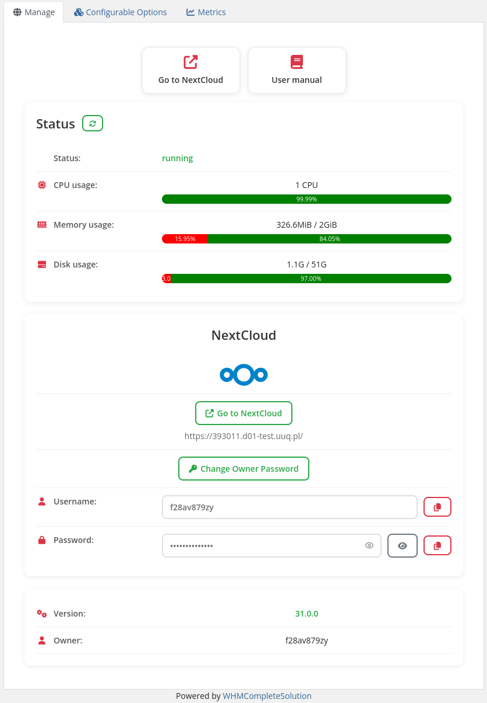

# Home screen

### Docker NextCloud module **[WHMCS](https://puqcloud.com/link.php?id=77)** 

##### [Order now](https://puqcloud.com/whmcs-module-docker-nextcloud.php) | [Download](https://download.puqcloud.com/WHMCS/servers/PUQ_WHMCS-Docker-NextCloud/) | [FAQ](https://faq.puqcloud.com/) | [n8n](https://puqcloud.com/link.php?id=117)

### **Client Area Overview – Logical Structure**

The **main screen** of the client area for the NextCloud service is divided into **three logical sections**:

1. **Navigation Block**
    
    
    - **"Go to NextCloud"**: Direct link to your NextCloud web interface.
    - **"User Manual"**: Provides direct access to official NextCloud documentation and user guides.
2. **Resource Usage Block**
    
    
    - Displays real-time metrics about your NextCloud container’s resource utilization: 
        - **CPU Usage**: Displays allocated CPUs and current load percentage.
        - **Memory Usage**: Shows RAM consumption, providing clarity on resource availability.
        - **Disk Usage**: Indicates used and available storage space within the container.
    - Helps users **monitor container performance** and assess whether a **plan upgrade** might be necessary.
3. **Application Information &amp; Controls**
    
    
    - **NextCloud Version**: Shows the installed version of NextCloud.
    - **Administrator Information**: Identifies the primary account managing the NextCloud instance.
    - **User List**: Displays all active users associated with the NextCloud instance.
    - **Reset Password Button**: Enables administrators to reset their login password conveniently.

This **clear and intuitive structure** ensures users have **easy access** to their NextCloud instance, facilitates **efficient real-time monitoring** of resources, and centralizes **critical management functionalities** for streamlined operation.

