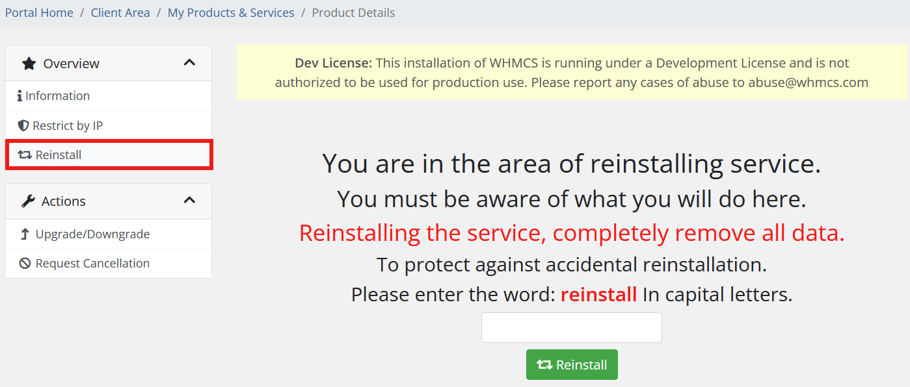

# Reinstall

### Docker NextCloud module **[WHMCS](https://puqcloud.com/link.php?id=77)** 

##### [Order now](https://puqcloud.com/whmcs-module-docker-nextcloud.php) | [Download](https://download.puqcloud.com/WHMCS/servers/PUQ_WHMCS-Docker-NextCloud/) | [FAQ](https://faq.puqcloud.com/) | [n8n](https://puqcloud.com/link.php?id=117)

Clients have the ability to **fully reinstall their NextCloud instance** directly from the client area. This feature is helpful in cases where a clean setup is needed due to misconfiguration or performance issues.

**Important:** Reinstalling the instance will result in **permanent data loss**. All files, user accounts, and settings stored within the container will be erased and replaced with a fresh NextCloud installation.

The reinstall process can be launched from the **Reinstall** page in the client interface. To avoid accidental reinstallation, the module includes a **confirmation prompt** to protect the user from unintended actions.

