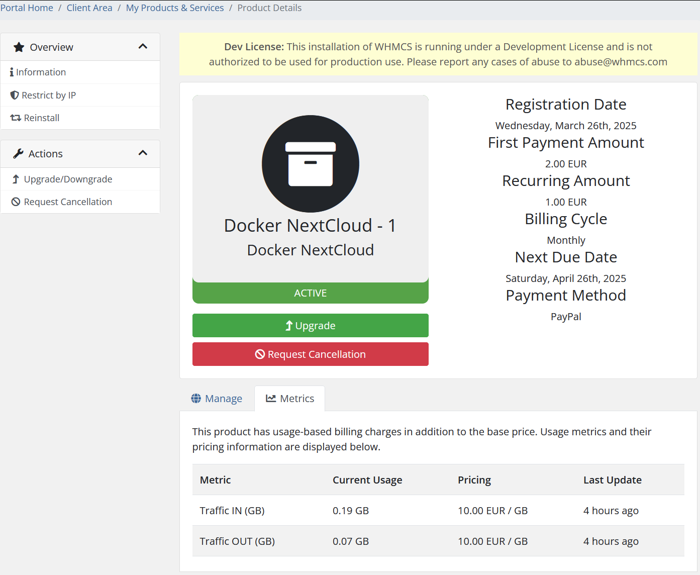

# Metrics

### Docker NextCloud module **[WHMCS](https://puqcloud.com/link.php?id=77)** 

##### [Order now](https://puqcloud.com/whmcs-module-docker-nextcloud.php) | [Download](https://download.puqcloud.com/WHMCS/servers/PUQ_WHMCS-Docker-NextCloud/) | [FAQ](https://faq.puqcloud.com/) | [n8n](https://puqcloud.com/link.php?id=117)

If you are using metric-based billing for your NextCloud service (e.g., billing based on bandwidth, disk usage, or other resource consumption), the **Metrics** tab in the client area provides detailed usage statistics.

This data can help users monitor their usage trends and predict when they may need to upgrade or adjust their current plan. Administrators can also use this data for transparent and accurate billing.

